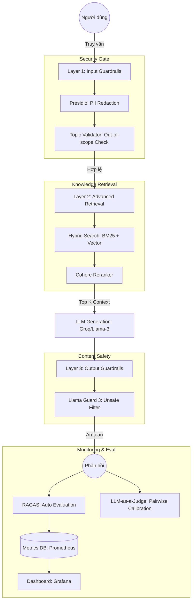

# Technical Blueprint: Secure & Observable Production RAG System

**Họ và tên**: Nguyễn Trí Cao  
**MSSV**: 2A202600223  
**Dự án**: AI Corporate Legal Assistant  

---

## 1. Giới thiệu (Overview)
Tài liệu này mô tả kiến trúc hệ thống RAG (Retrieval-Augmented Generation) chuyên dụng cho dữ liệu pháp lý doanh nghiệp. Mục tiêu cốt lõi của kiến trúc là đảm bảo **Tính an toàn (Security)**, **Độ tin cậy (Reliability)** và **Khả năng giám sát (Observability)** thông qua chiến lược phòng thủ chiều sâu (Defense-in-depth) và hệ thống đánh giá tự động liên tục.

---

## 2. Định nghĩa SLOs (Service Level Objectives)
Để đảm bảo chất lượng dịch vụ, chúng tôi thiết lập 5 chỉ số SLO cốt lõi với các ngưỡng cảnh báo (Alert Thresholds) cụ thể:

| Phân loại | Metric | Mục tiêu (Target) | Ngưỡng cảnh báo (Alert) | Độ ưu tiên |
|---|---|---|---|---|
| **Chất lượng** | Faithfulness Score | ≥ 0.85 | < 0.80 trong 30 phút | P2 |
| **Bảo mật** | PII Leakage Rate | 0% | > 0% (Bất kỳ rò rỉ nào) | P0 (Critical) |
| **Hiệu năng** | P95 Latency | < 3.0s | > 4.0s trong 5 phút | P1 |
| **Độ chính xác** | Answer Relevancy | ≥ 0.80 | < 0.75 trong 1 giờ | P2 |
| **Bảo vệ** | Guardrail False Positive | < 5% | > 10% | P3 |

---

## 3. Sơ đồ Kiến trúc Hệ thống (System Architecture)

Hệ thống được thiết kế theo mô hình **4 lớp phòng thủ** tích hợp:

---

## 4. Phân tích chi tiết các lớp thành phần

### 4.1. Layer 1: Input Guardrails (Độ trễ dự kiến: ~200-500ms)
- **PII Redaction (Presidio)**: Tự động nhận diện và che giấu các thông tin nhạy cảm như CCCD, SĐT, Email trước khi gửi đến LLM ngoại vi. Sử dụng các mẫu Regex tùy chỉnh cho định dạng Việt Nam.
- **Topic Validation**: Sử dụng Zero-shot Classification để từ chối các câu hỏi không liên quan đến pháp luật doanh nghiệp (ví dụ: giải trí, chính trị), giúp tiết kiệm chi phí API và tránh lạm dụng hệ thống.

### 4.2. Layer 2: Retrieval & Generation (Độ trễ dự kiến: ~1.5s - 2.5s)
- **Hybrid Search**: Kết hợp khả năng tìm kiếm từ khóa chính xác (BM25) và tìm kiếm ngữ nghĩa (Qdrant Vector DB).
- **Reranker (Cohere)**: Lọc lại Top 5 kết quả có độ tương quan cao nhất để cung cấp ngữ cảnh tinh khiết nhất cho LLM, giảm thiểu hiện tượng "ảo giác" (Hallucination).

### 4.3. Layer 3: Output Guardrails (Độ trễ dự kiến: ~500-800ms)
- **Llama Guard 3**: Một mô hình ngôn ngữ nhỏ chuyên biệt được fine-tuned để phân loại nội dung phản hồi. Nếu câu trả lời chứa mã độc, nội dung bạo lực hoặc không phù hợp, hệ thống sẽ chặn và trả về thông báo lỗi mặc định.

### 4.4. Layer 4: Monitoring & Evaluation (Asynchronous)
- **RAGAS Evaluation**: Chạy định kỳ trên tập Testset tổng hợp để theo dõi sự suy giảm chất lượng của mô hình (Model Drift).
- **LLM-as-a-Judge**: Sử dụng một LLM mạnh hơn (như GPT-4) để chấm điểm các câu trả lời của LLM hiện tại, đảm bảo tính khách quan thông qua cơ chế so sánh cặp (Pairwise).

---

## 5. Chiến lược Giám sát & Vận hành (Monitoring Strategy)

### 5.1. Thu thập dữ liệu
- **Logs**: Toàn bộ Input/Output và kết quả Guardrails được đẩy vào ELK Stack (Elasticsearch, Logstash, Kibana).
- **Metrics**: Độ trễ từng lớp, tỉ lệ chặn của Guardrails được thu thập bởi Prometheus.

### 5.2. Dashboard & Alerting
- **Grafana Dashboard**: Hiển thị biểu đồ thời gian thực về các chỉ số SLO.
- **Alertmanager**: Gửi thông báo qua Slack/Telegram khi bất kỳ Alert Threshold nào ở Section 2 bị vi phạm trong thời gian dài (ví dụ: P95 Latency > 4s liên tục trong 5 phút).

---

## 6. Kế hoạch Xử lý Sự cố (Remediation Plan)

Khi hệ thống vi phạm SLO, quy trình xử lý sẽ như sau:

1. **Sự cố Chất lượng (Faithfulness/Relevancy Low)**:
   - Kiểm tra lại tập dữ liệu Knowledge Base.
   - Điều chỉnh tham số Reranker hoặc nâng cấp LLM Prompting.
2. **Sự cố Hiệu năng (High Latency)**:
   - Tạm thời tắt bớt các lớp Guardrail không thiết yếu (như Topic Validation).
   - Tăng số lượng Replica cho Vector DB hoặc chuyển sang LLM Provider có thông lượng cao hơn.
3. **Sự cố Bảo mật (PII Leakage)**:
   - Ngắt kết nối API ngay lập tức.
   - Cập nhật thêm các Pattern nhận diện thực thể mới vào Presidio Analyzer.

---